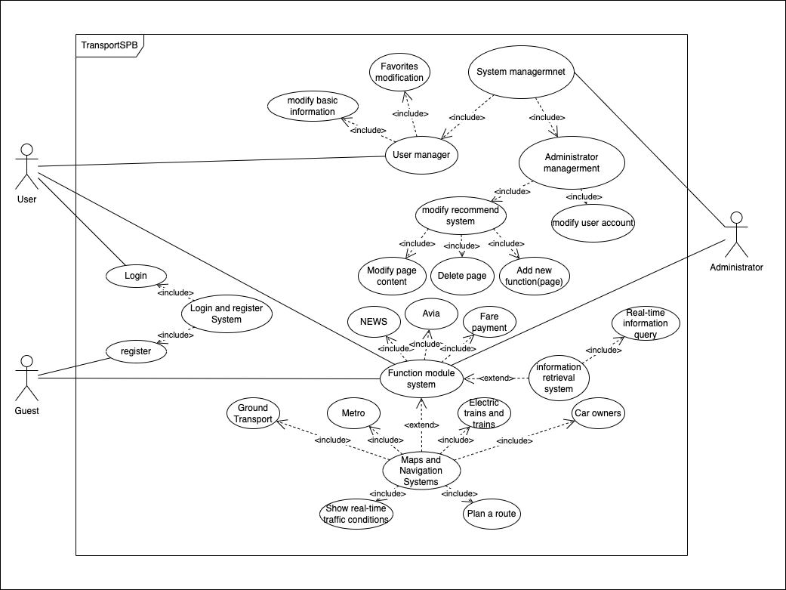

# Transport System

## List of actors

Guest:

* Register an account
* Read the news about traffic
* Different modes of transportation modules (excluding driver's own drive, which is another requirement). Each mode of transportation module should contain basic route planning, the time spent on the planned route, the general route map of the mode of transportation (such as a subway map, a bus route map), and the price of the fare (or other means of charging). Special functions can be added for different modes of transportation, for example, buses between cities can be added.
* Information useful to drivers is available on the web. For example highway and parking lot information.
* Read advertisement
* The main page has direct access to the most popular and frequently used functions
* Visit third party website
* Read fare information (policy, fare composition, etc.)
* Buy tickets

User:

* The second to the last functions of guest
* Edit own information
* Change Password
* Create your own favorites

Administrator:

* Delete account of users
* Create random users
* Update all informations(includes news, posts, traffic jam, tickets) in website
* All the functions of users and guest
* Advertisement edit

## Description of Use Cases

|               Name               |                         Description                          |
| :------------------------------: | :----------------------------------------------------------: |
|         Login Use Cases          |       Provide users with the function of website login       |
|       Register User Cases        |   Provide users with the function of website registration    |
|       Management Use Cases       | Provide users and administrators with the function of managing accounts respectively |
| Web Map And Navigation Use Cases | Basic functions of websites. Include search timetable of train and airplane, search informations about parking land in this city, the schedule, pay and route of public transportations and so on by enter different model. |
|    Favorites Management Cases    | Create and manage user's favorites(only for users or administrator) |
|      Random user Use Cases       |            For Administrator to create test users            |
|     Website Management Case      | For administrator to modify content, optimize, add and delete functions |
|          Read News Case          |                      Read traffic news                       |
|        Advertisement Case        |                 Show Commercial advertising.                 |
|         Buy Ticket Case          |       Buy tickets of different kinds of transportation       |
|     Third party website Case     |    To provide features and links to third-party websites     |

## BOM Portal Use Cases

|     Use Cases     |                            Login                             |
| :---------------: | :----------------------------------------------------------: |
| Brief Description |            Guiding users to login to the website             |
|       Actor       |                    User and administrator                    |
|   Preconditions   |         User or administrator had created an account         |
|    Basic Path     | The user enters the user name and password, chooses whether to remember me, and clicks the login button |
| Alternative Path  | The user forgets his password, click forgot password, jump to the password modification page, enter your personal information, and enter a new password, click modify password |
|  Postconditions   | If the login is successful, it will jump to the homepage, else if the login fails or the password modification is successful, it will jump to the login page, if the password modification fails, it will return to the password modification page. |

|     Use Cases     |                           Register                           |
| :---------------: | :----------------------------------------------------------: |
| Brief Description |               Guiding guest to get own account               |
|       Actor       |                  Guests and administrators                   |
|   Preconditions   |                              -                               |
|    Basic Path     | Guest input basic informations of his/her account, which includes login, password, email and so on |
| Alternative Path  |  Jump to login page or return a error while email was used   |
|  Postconditions   | Post form, which is filled by guest. Check if his/her email was used earlier. If email is occupied, then return to register page and offer a tip about it. |

|     Use Cases     |                 System           Management                  |
| :---------------: | :----------------------------------------------------------: |
| Brief Description |     Allow user and administrators manage their accounts      |
|       Actor       |                   Users and administrators                   |
|   Preconditions   |                        Already login                         |
|    Basic Path     | The user modifies the content in the favorites, and modifies the user's email or password |
| Alternative Path  | If you are an administrator account, you can delete other users' accounts and modify the content of the news |
|  Postconditions   | After the modification is completed, return whether the modification is successful |

|     Use Cases      |                 Information retrieval system                 |
| :----------------: | :----------------------------------------------------------: |
| Brief Descriptions | Basic and most important case of this site. Allow user to search the traffic informations they need in this city. |
|   Primary Actor    |                Guest, user and administrator.                |
|   Preconditions    |                              -                               |
|     Basic Path     | Enter different block of this page to find the corresponding information. |
|  Alternative Path  | Enter key word to search information(this function is supported by Google) |
|   Postconditions   |     System return the information by operation of users      |

|     Use Cases      |                      Random users                       |
| :----------------: | :-----------------------------------------------------: |
| Brief Descriptions |    Administrators create any account to test system     |
|   Primary Actor    |                     Administrators                      |
|   Preconditions    |          Have the privilege of administrators           |
|     Basic Path     | Create an account and visit website like a commend user |
|  Alternative Path  |                            -                            |
|   Postconditions   |                   Like register cases                   |

|     Use Cases      |                   Administrator Management                   |
| :----------------: | :----------------------------------------------------------: |
| Brief Descriptions |            Administrators and modify the website             |
|   Primary Actor    |                        Administrators                        |
|   Preconditions    |             Have the privilege of administrators             |
|     Basic Path     | Modify the informations showed on website(like news or advertisements). Modify the appearance of website. Delete, add or optimize existing functions |
|  Alternative Path  |                              -                               |
|   Postconditions   |    Administrators can change the website as their wishes     |

|     Use Cases      |             Web Maps and Navigation Systems             |
| :----------------: | :-----------------------------------------------------: |
| Brief Descriptions |           Choose the model, which user wants.           |
|   Primary Actor    |                       All actors                        |
|   Preconditions    |                            -                            |
|     Basic Path     | Choose different model and go to the corresponding page |
|  Alternative Path  |          Choose popular functions on main page          |
|   Postconditions   |               Returns corresponding page                |

|     Use Cases      |             News System              |
| :----------------: | :----------------------------------: |
| Brief Descriptions |     Show currently traffic news      |
|   Primary Actor    |              All actors              |
|   Preconditions    |                  -                   |
|     Basic Path     |           Enter news block           |
|  Alternative Path  | Show some current news on index page |
|   Postconditions   |   Enter news page, which is chosen   |

|     Use Cases      |     Advertisement System      |
| :----------------: | :---------------------------: |
| Brief Descriptions | Show commercial advertisement |
|   Primary Actor    |          All actors           |
|   Preconditions    |               -               |
|     Basic Path     |       Show on main page       |
|  Alternative Path  |               -               |
|   Postconditions   | Click and enter advertisement |

|     Use Cases      |                  Third party website System                  |
| :----------------: | :----------------------------------------------------------: |
| Brief Descriptions | Provide third-party functional interfaces for third-party websites such as Google, bus2bus |
|   Primary Actor    |                          All actors                          |
|   Preconditions    |                              -                               |
|     Basic Path     | Display third-party ticketing sites and google search pages on the home page |
|  Alternative Path  |                              -                               |
|   Postconditions   |               Redirect to third-party website                |
|     Use Cases      |                      But Tickrts                      |
| :----------------: | :---------------------------------------------------: |
| Brief Descriptions |            Buy tickets, which user wants.             |
|   Primary Actor    |                User and administrator                 |
|   Preconditions    |                           -                           |
|     Basic Path     | Choose transportation and ticket, and then pay for it |
|  Alternative Path  |                           -                           |
|   Postconditions   |                    Returns ticket.                    |

## Use Cases

